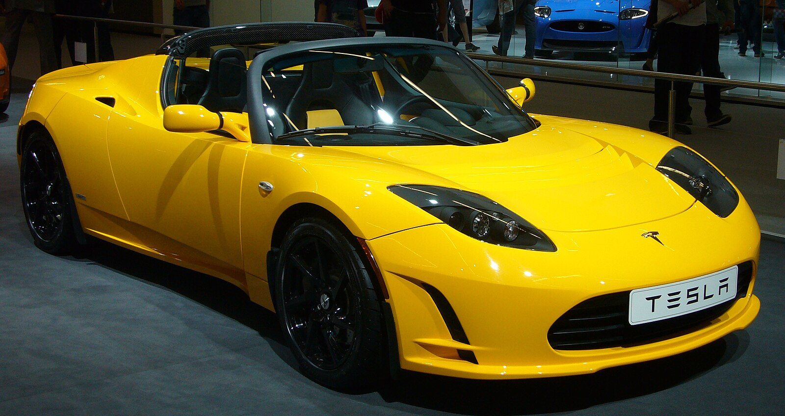
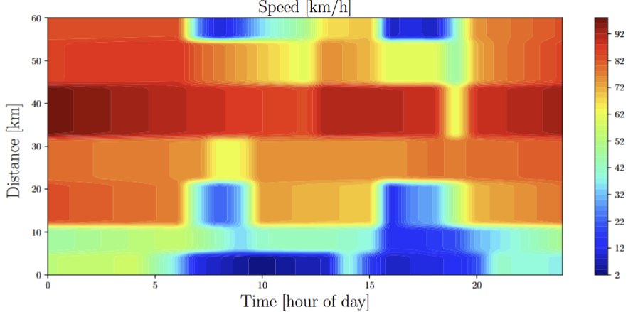

# EV Range Estimation — Tesla Roadster Simulation

This project extends a navigation app and onboard computer for electric vehicles with functionality to estimate driving range along a given route. Range depends strongly on speed, so consumption and travel time vary between routes. We use consumption data for the Tesla Roadster together with GPS-derived speed data, but the methods generalize to other vehicles and routes.

---

### Part 1a) Energy Consumption Model

**Task:**  
Model energy consumption as a function of speed using the fitted relation

$$
c(v) = a_1 v^{-1} + a_2 + a_3 v + a_4 v^2
$$

with coefficients $a_1=546.8$, $a_2=50.31$, $a_3=0.2584$, $a_4=0.008210$.
 
Implement `consumption(v)` that works with scalars and NumPy arrays, and plot $c(v)$ for $v \in [1,200]$ km/h.

**How I did it:**  
Implemented the formula in `roadster.py` and added a plotting routine in `script_part1a.py`.

**Solution:**  
Function in `roadster.py`; plots in `script_part1a.py`.

---

### Part 1b) Route Data & Speed Profile

**Task:**  
Load route data (`speed_anna.npz`, `speed_elsa.npz`) and plot speed vs. distance. Interpolate a continuous speed profile using `velocity(x, route)`.

**How I did it:**  
Used `roadster.load_route` to read data and scatter-plot raw samples. Then evaluated `velocity` densely to plot the interpolated curve.

**Solution:**  
Functions in `roadster.py`; plots in `script_part1b.py`.

**Note:**  
`velocity` uses **PCHIP interpolation**, which passes through all data points and ensures monotone, smooth behavior between them.

---

### Part 2a) Travel Time (Trapezoidal Rule)

**Task:**  
Estimate travel time along a route by integrating  

$$
T(x) = \int_0^x \frac{1}{v(s)} ds
$$

Implement `time_to_destination(x, route, n)` using the trapezoidal rule.

**How I did it:**  
Coded a manual trapezoidal integration (no NumPy/SciPy integrators) and tested convergence by increasing \(n\) until results stabilized to the nearest minute.

**Solution:**  
Function in `roadster.py`.

---

### Part 2b) Total Energy Consumption (Trapezoidal Rule)

**Task:**  
Estimate total energy usage along a route by integrating  

$$
E(x) = \int_0^x c(v(s))ds.
$$

Implement `total_consumption(x, route, n)`.

**How I did it:**  
Combined `consumption` with interpolated speeds from `velocity`, then applied trapezoidal integration over the route length.

**Solution:**  
Function in `roadster.py`.

---

### Part 3a) Distance from Time — Root Finding (Newton’s Method)

**Task:**  

Given $T>0$, find $x\ge 0$ such that

$$
T(x)=T,\qquad
T(x)=\int_{0}^{x}\frac{1}{v(s)}\,ds.
$$

Newton’s method: define

$$
F(x)=T(x)-T,\qquad F'(x)=\frac{1}{v(x)},
$$

then iterate

$$
x_{k+1}=x_k-\frac{F(x_k)}{F'(x_k)}
      =x_k-\big(T(x_k)-T\big)*v(x_k).
$$

**Implementation notes**

- Use `time_to_destination(x, route, n)` for $T(x)$ and `velocity(x, route)` for $v(x)$.

- Initial guess:

$$
x_0 = \min\Big(L, L\frac{T}{T(L)}\Big),
$$

where $L$ is the route length and $T(L)$ the total travel time.
- Clamp iterates to $[0,L]$ and stop when

$$
|x_{k+1}-x_k| < 10^{-4}\ \text{km},
$$

with a hard cap on iterations.

- Accuracy depends on the trapezoidal resolution $n$ inside `time_to_destination` and the Newton stopping tolerance.

**Solution:**  
Function `distance(T, route)` in `roadster.py`.

---

### Part 3b) Range from Battery Energy — Newton’s Method

**Task.** Given battery charge C (Wh), find the range x km along a route.  
Total energy up to distance x is:

$$
E(x)=\int_{0}^{x} c\big(v(s)\big)ds \quad [\mathrm{Wh}].
$$

We solve for x such that $E(x)=C$ by Newton’s method. Define

$$
F(x)=E(x)-C, \qquad F'(x)=E'(x)=c\big(v(x)\big),
$$

then update

$$
x_{k+1}=x_k-\frac{E(x_k)-C}{c\big(v(x_k)\big)}.
$$

**Solution:**  
Function `reach(C, route)` in `roadster.py`.

---

### Part 4a) Time-Dependent Route Simulation

**Task:**  
Simulate travel along a route where speed depends on both position and time of day, based on historical traffic data. The aim is to estimate arrival time given a start time, and generate route files that can be used as input for earlier functions (e.g. `reach` from Part 3b).

**How I did it:**  
Used the provided function `route_nyc(t, x)` in `route_nyc.py`, which returns the expected speed (km/h) at time `t` [hours of day] and position `x` [km] along a 60 km route.

---

### Part 4b) Plotting Route Simulations

**Task:**  
Update the plotting script to show simulated trips along the NYC route with different start times. Each trip is represented by a curve from start time $t_0$ at position $x=0$ to the route end at $x=60$ km.

**How I did it:**  
Modified `script_part4b.py` to simulate and plot two runs:
- Start at **04:00**
- Start at **09:30**

The curves illustrate how traffic conditions at different times of day affect travel along the route.

**Solution:**  
Code updates in `script_part4b.py`.

