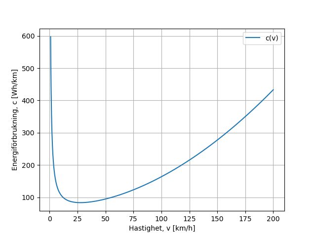
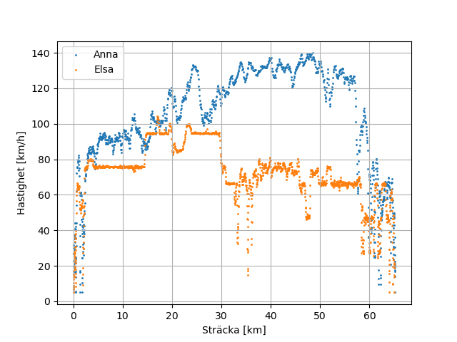
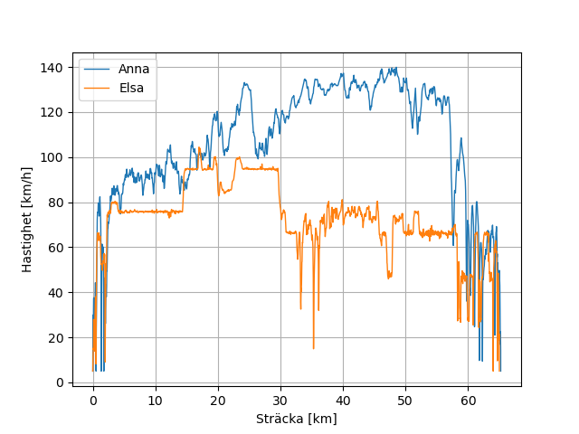
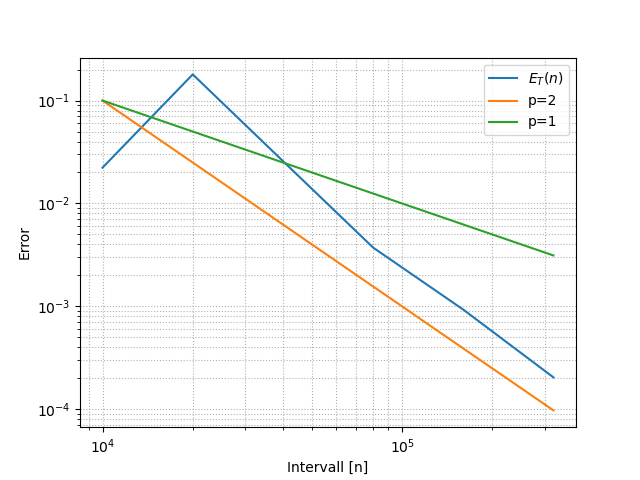
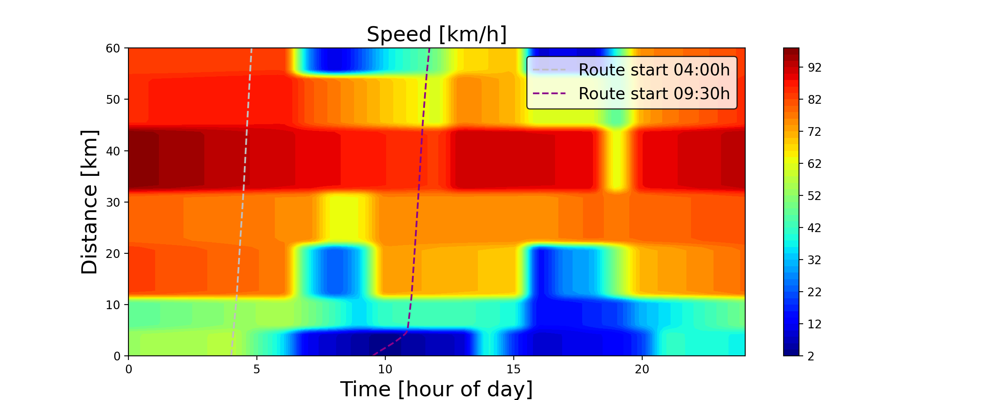

# Resultat — Räckvidd för elbil

---

## Översikt

---

## Konsumtionsdata (c(v))
Energiförbrukning som funktion av hastighet.

---

## Ruttdata
Hastighetsdata längs rutterna samt anpassade funktioner.

| Hastighetsdata | Anpassad funktion |
|---|---|
|  |  |

---

## Konvergensstudie (trapetsmetoden)
Integrationsfelet som funktion av antal delintervall \(n\).

---

## Simulering av rutt (Euler framåt)
Simulerade resor med olika starttider \(t_0\).

---

## Noteringar
- Denna sida speglar **resultatavsnittet** i LaTeX-rapporten; endast bildvisning i Markdown.
- Se rapporten för fulla resonemang, ekvationer och metoddetaljer.
